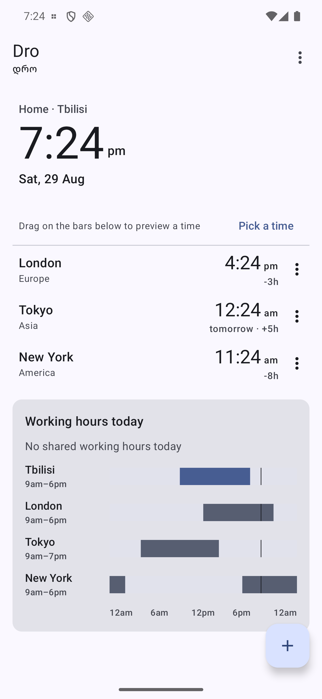
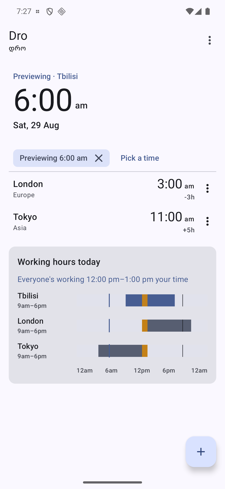
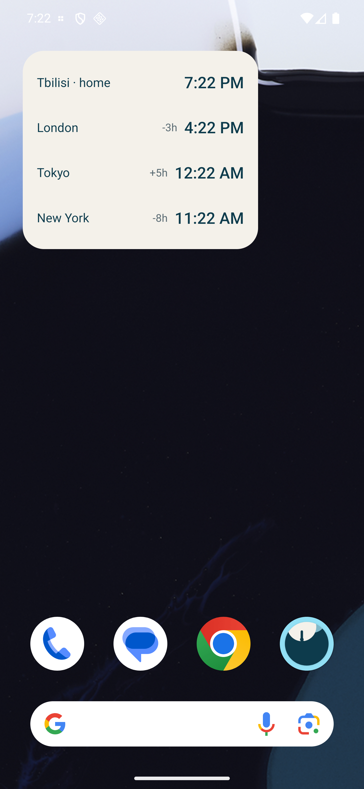
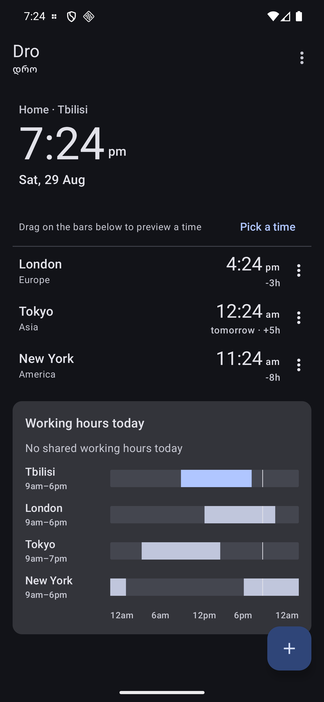

# Dro 🕰

[](https://github.com/Meko123456/Dro/actions/workflows/ci.yml)
[](https://github.com/Meko123456/Dro/releases)
[](LICENSE)

**დრო** (*dro* — Georgian for "time") — a small Android app for people whose day is
spread across time zones: a live clock for each city you care about, a **working-hours
overlap** strip that shows when everyone is actually at their desk, and a home-screen
widget that keeps ticking without waking the phone.

No accounts, no network, no analytics. Time zones come from the platform's own tz database.

## Why this app exists

I live in Tbilisi and work with a team that is rarely in the same time zone as I am. The
question I ask several times a day is not *"what time is it in X"* but *"when today can I
reach X during their working hours, and what does that cost me in mine?"* Generic world
clocks answer the first question; Dro is built around the second.

(A small irony behind the name: the two cities I move between, Tbilisi and Dubai, are both
UTC+4 all year — the original "dual clock" idea was a no-op, so the app grew into the
overlap finder it should have been from the start.)

## Screenshots

| Clocks | Overlap + preview | Widget | Dark |
|:---:|:---:|:---:|:---:|
|  |  |  |  |

## Features

- 🏠 **Home + cities** — pick a home zone and any number of others. Each row shows the local
  time, a *tomorrow* / *yesterday* badge when the date differs from home, and the offset
  relative to home (`+5h`, `-1h 30m`). Change home from any row and every offset re-bases.
- ⏱ **Live** — clocks tick on the wall-clock minute boundary (the delay is "until the next
  :00", not a fixed 60 s), only while the screen is visible. Honours the device 12/24-hour
  setting.
- 🗓 **Working-hours overlap** — a 24-hour bar per city (default 09:00–18:00 local, editable,
  overnight shifts allowed) laid out on the home zone's axis, with the window where everyone
  is at work drawn across all bars and summarised as *"Everyone's working 12:00–13:00 your
  time"*. A city whose day straddles home midnight shows as two segments; half-hour zones,
  and 23/25-hour DST days in the home zone, are handled and unit-tested.
- 🎚 **Time scrubber** — press or drag on the bars to preview any moment: every clock re-reads
  at that instant, a chip names the previewed time, tap it to return to now. *Pick a time*
  opens a dialog for the same thing without a gesture.
- 📱 **Widget** — a classic `RemoteViews` app widget built on `TextClock`, one per zone with
  its own `timeZone`. The system keeps the clocks current itself: `updatePeriodMillis` is 0,
  the app schedules **no alarms, no WorkManager, no wakeups**. Glance can't express a
  self-ticking clock without periodic updates, so this is one of the places the old API is
  the right one. Re-rendered when the city list changes; *Add widget to home screen* in the
  app uses the Android 8 pin flow.
- 🔒 **Private by design** — preferences only (DataStore); the app declares no permissions and
  never touches the network. Time zones come from the platform tz database.
- ♿ **Accessible** — each clock row reads as one sentence ("Tokyo, 12:23 am, 5 hours ahead,
  tomorrow"), each bar as "London works 9:00 am–6:00 pm local, 12:00 pm–9:00 pm your time",
  row actions are menu items rather than gestures, and the scrubber has a dialog equivalent.
- 🎨 **Material 3** — dynamic color, light/dark, edge-to-edge.

## Architecture

```
domain/   pure Kotlin, 54 unit tests — ZoneClock (local time / day shift / offset label),
          ZoneCatalog (tz database → searchable cities), WorkingHours + OverlapFinder
          (shared window on the home-day axis), Settings + SettingsCodec, TimeFormat
data/     DataStore preferences: home zone, city list, working-hours overrides
ui/       Compose — clock list, add-city sheet, overlap strip + scrubber, hour dialogs
widget/   RemoteViews + TextClock app widget
```

Pure logic never touches Android: everything under `domain/` is `java.time` and plain
Kotlin, tested with JUnit against fixed instants — including the London spring-forward and
fall-back days, where the home day is 23 or 25 hours long and the strip's axis is elapsed
minutes rather than wall-clock so it stays linear.

## Building

```
./gradlew :app:assembleDebug :app:testDebugUnitTest
```

Kotlin 2.3, AGP 9, Compose BOM 2026.06, minSdk 26.

## License

[MIT](LICENSE) © 2026 Merab Kochlamazashvili
